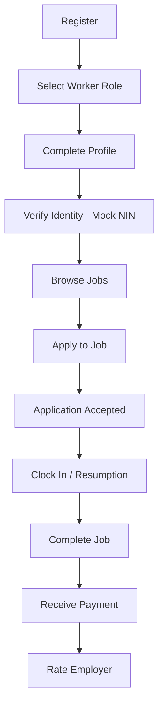
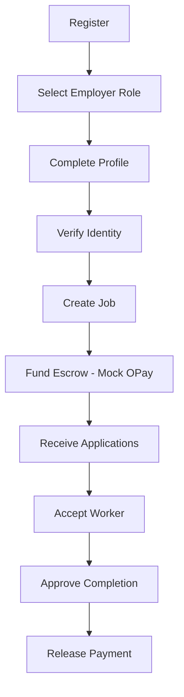
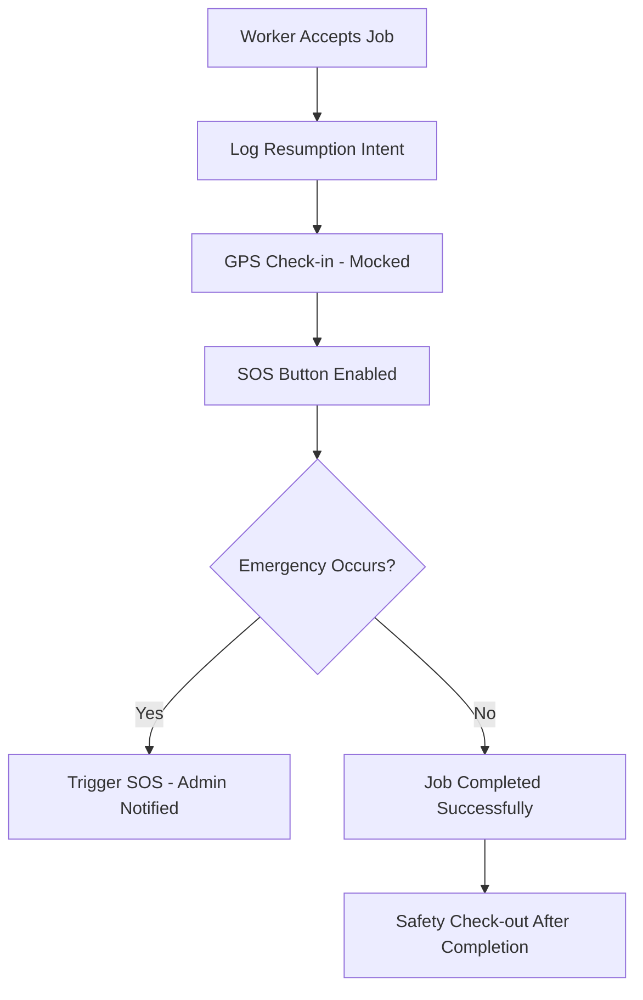

# WorkNow - User Journeys & Safety Flows

Below are the mapped user flows representing the worker journey, employer journey, and platform safety operations.

---

## 1. Worker Journey

---

## 2. Employer Journey

---

## 3. Safety & SOS Flow

